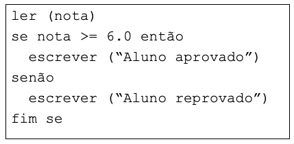
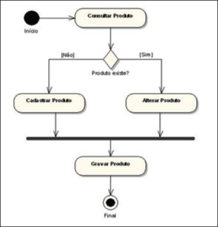
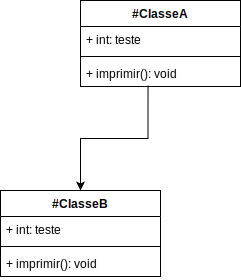
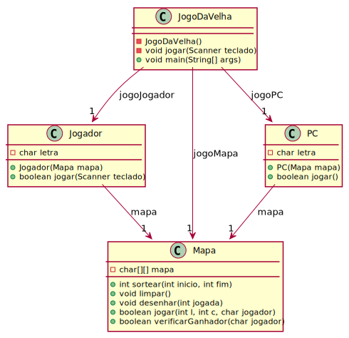
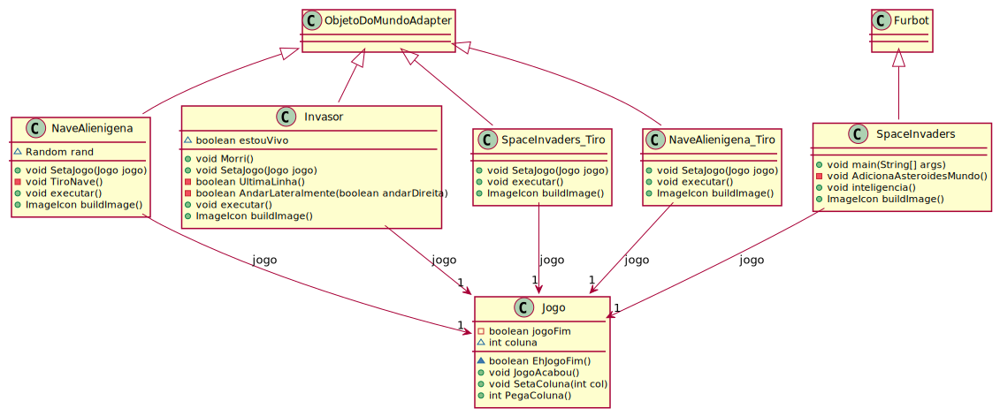

[Questionário 1]: <https://ava3.furb.br/mod/quiz/view.php?id=1103187> "Questionário 1"  

# Introdução à Programação - Unidade 1

Algumas anotações feitas na aula: [aulaAnotacoes](./aulaAnotacoes.md "aulaAnotacoes")

## Fundamentos da Programação de Computadores - parte 1

### [Videoaula_1_1 (14:06)](<https://furb-my.sharepoint.com/:v:/g/personal/dalton_furb_br/EcYN8E_Ky9NHvHmjXVFermMBrA1b-rN4IzI7tyPdHxDWhg?e=d1FHSY> "primeira videoaula da unidade 1")  

- Os computadores são máquinas programáveis utilizadas para automatizar tarefas​.  
- As ações executadas por estas máquinas são baseadas em dados e regras que dependem da aplicação para as quais são criadas​.  
- A programação de um computador é uma tarefa executada pelo programador​.  

### Solução de Problemas

- O computador segue as ordens (**comandos** e **instruções**) contidas em um programa de computador e escritas em uma linguagem de programação​.  
- A sequência lógica e coerente destas ordens é representada através de Algoritmos, Fluxogramas ou Diagramas​.  
- A implementação destas ordens em uma linguagem computacional é denominada de Programa de Computador​.  

#### Imagem do bolo confeitado

  

#### Imagem cozinhando macarrão

  

- **A solução de um problema** com base em um **software** envolve um conjunto de **processos** (regras) que operam sobre **dados**, necessitando de **recursos** (dados de Entrada) e produzindo **resultados** (dados de Saídas)​.  
- **Processos** (regras) são as ações executadas pelo computador para operar ou transformar os dados.  

#### Imagem das etapas: Entrada, Processo e Saída

  

### Exercícios - parte 1

- Responda o quiz no AVA3​: [Questionário 1].  
- Acompanhe os exercício em sala​.  

----------

## Fundamentos da Programação de Computadores - parte 2

### [Videoaula_1_2 (18:57)](<https://furb-my.sharepoint.com/:v:/g/personal/dalton_furb_br/EaD5MAtYXMNKpRkteuPRf-wBkMvx-lQHW47yMFFISOWybw?e=2IM9Ko> "link alternativo da segunda videoaula da unidade 1")  

### Ciclo de Vida de um Software​

- O **desenvolvimento de um software** é realizado em diversas etapas denominadas de ciclo de vida.  
- As etapas mais comuns do ciclo de vida de um software são:​  
  - **levantamento de requisitos**: consiste no levantamento das funcionalidades que se deseja para o software. É o momento de se compreender o problema. Estabelece o que se chama de domínio do problema;​  
  - **análise**: consiste na elaboração dos modelos que irão representar o sistema a ser desenvolvido. É feita com base nos requisitos estabelecidos na etapa anterior;  
  - **projeto**: consiste na concepção de como o sistema deve funcionar, definindo características tecnológicas e de arquitetura do sistema e  as estruturas de dados e de controle a serem utilizadas ou construídas;  
  - **implementação**: consiste na codificação dos programas necessários para que o software funcione adequadamente;  
  - **testes**: consiste nos testes do software para verificar se ele atende os requisitos e necessidades para o qual foi proposto;​  
  - **implantação**: consiste em colocar o software em funcionamento para o seu usuário ou grupo de usuários;  
  - **manutenção**: consiste em operações de atualização ou correção do software.​  

#### Imagem do Ciclo de Vida de um Software

  

### Métodos de Especificação de Problemas

- As abordagens mais comuns para o desenvolvimento de software atualmente são:​  
  - **estruturada**: neste método, os dados são modelados separados das funções. Assim, normalmente modelam-se os dados com diagramas de entidades e relacionamentos e as funções através de diagramas de fluxo de dados;  
  - **orientada a objetos**: neste método, dados e funções são modelados juntos, buscando-se representações próximas ao mundo real. Normalmente, os problemas são modelados através de diagramas da UML (Unified Modeling Language)​.  
- A definição da metodologia de desenvolvimento influencia diretamente na etapa de codificação dos programas, definindo, portanto, a forma que se deve fazer a Programação do Software​;  
  - Abordagem Estruturada;  
  
  - Abordagem Orientada a Objetos;  
  

### Técnicas para Representação de Soluções  

- As principais técnicas para representações de soluções de problemas com base em softwares são:  
  - Algoritmos, Fluxogramas ou Diagramas;  
- **NÃO EXIGEM** um computador para serem executados e testados.​  

### Algoritmos​  

- Representam as instruções para a solução de um problema com base em um subconjunto de palavras de uma língua (p. ex. língua portuguesa).  
- Também são conhecidos por [pseudolinguagem](https://pt.wikipedia.org/wiki/Pseudocódigo "pseudolinguagem é uma linguagem hipotética,que tem por objetivo ser um instrumento didático para auxiliar na dinâmica ensino-aprendizado. Ela contém os principais elementos encontrados em praticamente todas as linguagens reais de programação de computadores.") ou pseudocódigo.  
- Tem uma estrutura semântica e sintática própria, mas que pode variar nas diferentes bibliografias ou formas de representação.  
- **Vantagem**: facilidade de elaboração.​  
- **Desvantagem**: legibilidade e ambiguidade em problemas não triviais.​  

#### Imagem de exemplo de um algoritmo  

  

### Fluxogramas (Diagrama de Blocos)​  

- É o tipo mais comum de representação de solução de problemas com base em uma notação gráfica.​  
- Contêm um conjunto de símbolos com significados específicos para cada instrução.​  
- **Vantagem**: legibilidade.​  
- **Desvantagens**: espaço e ferramentas para elaboração.​  

#### Imagem de exemplo de um fluxograma  

  

### Diagramas​  

- Outros tipos de diagramas também permitem a representação de soluções de problemas com base em notações gráficas.​  

#### Diagrama de Chapin (Nassi-Shneiderman)  

")  

#### Diagrama de Estados  

  

#### Diagrama de Classes  

    Exemplo: no IDE VSCode  
<!-- ☞ 0f806a46-e151-4a52-88db-5810a3721c6f -->
  
[ClasseA.java](./src/ClasseA.java "ClasseA.java")  
[ClasseB.java](./src/ClasseB.java "ClasseB.java")  
[classeAB.drawio.svg](./imgs/classeAB.drawio.svg "classeAB.drawio.svg")  

    Exemplo: Jogo da Velha  
  

    Exemplo: Space Invaders  
  

### Solução de Problemas​  

- A solução de um problema computacional requer:​  
  - **busca de outras experiências e soluções para problemas semelhantes**: soluções já existentes podem e devem ser consultadas antes de se tentar propor uma nova solução.  
  - **divisão e conquista**: ao se deparar com um problema complexo, tenta-se reduzi-lo a problemas menores e mais fáceis de serem tratados.  
  - **diversidade de soluções**: não é aconselhável comprometer-se imediatamente com uma única solução. Durante a solução do problema podem ser obtidas novas informações que permitirão a existência de novas alternativas.  
  - **a boa escolha de uma linguagem de programação**: as linguagens de programação tem suas características específicas, sendo mais ou menos adequadas para cada tipo de problema. O programador deve conhecer profundamente a linguagem escolhida para implementar um programa.  
- Para ser um bom Programador é necessário:​  
  - estudar soluções algorítmicas clássicas descritas na literatura.  
  - conhecer as estruturas e recursos oferecidos pelos ambientes e linguagens de programação.  
  - programar, programar e programar.  
- A tarefa fundamental do Programador é desenvolver ou aplicar os melhores algoritmos para cada situação-problema requeridos na construção de um software, utilizando a linguagem de programação mais adequada.​  

### Exercícios - parte 2  

- Responda o quiz no AVA3​: [Questionário 1].  
- Acompanhe os exercício em sala​.  

----------

### Principais Referências Bibliográficas​  

- CARBONI, Irenice de Fátima. **[Lógica de programação](https://bu.furb.br/consulta/portalConsulta/recuperaMfnCompleto.php?menu=rapida&CdMFN=265888)**. São Paulo : Pioneira Thomson Learning, 2003. 240 p, il.​  
- MANZANO, José Augusto N. G; OLIVEIRA, Jayr Figueiredo de. **[Algoritmos: lógica para desenvolvimento de programação](https://bu.furb.br/consulta/portalConsulta/recuperaMfnCompleto.php?menu=rapida&CdMFN=98280)**. São Paulo : Erica, 1996. 265p.​  
- SOUZA, Marco Antônio Furlan de. **[Algoritmos e lógica de programação](https://bu.furb.br/consulta/portalConsulta/recuperaMfnCompleto.php?menu=rapida&CdMFN=306850)**. São Paulo : Pioneira Thomson, 2005. xxiii, 214 p, il.
- VILARIM, Gilvan de Oliveira.  
  **[Algoritmos: programação para iniciantes.](https://bu.furb.br/consulta/portalConsulta/recuperaMfnCompleto.php?menu=rapida&CdMFN=319911)** 2. ed. Rio de Janeiro : Ciência Moderna, 2004. xiv, 270 p, il.​  
- XAVIER, Gley Fabiano Cardoso. **[Lógica de programação](https://bu.furb.br/consulta/portalConsulta/recuperaMfnCompleto.php?menu=rapida&CdMFN=267002)**. 7. ed. São Paulo : SENAC, 2004. xxv, 378 p, il. 1 CD-ROM. (Nova série informática).​  

----------

## ⏭ [Unidade 2)](../Unidade2/README.md "Unidade 2")  

